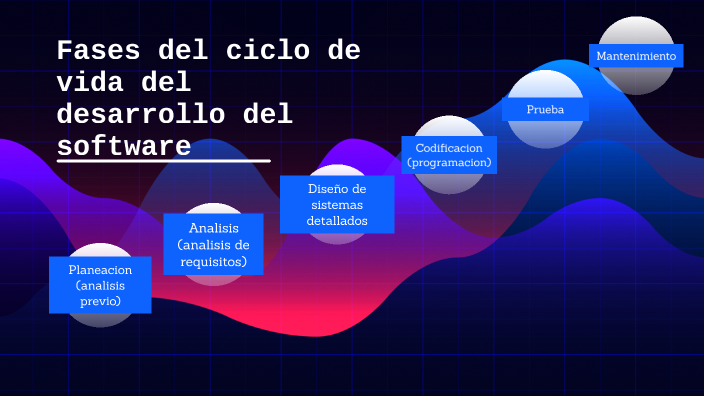

#Ejercicio 01#

**¿Qué es un programa informático?**

Un programa informático es un conjunto ordenado de instrucciones, escritas en un lenguaje de programación, para realizar una tarea en particular dentro de una computadora. En palabras sencillas, es una secuencia de órdenes que le indican a una computadora qué hacer.

Por lo regular, estos programas son desarrollados por personas que se dedican profesionalmente a la escritura de código, los cuales se conocen como programadores.

Los programas poseen en su núcleo un código fuente, que es el texto legible por los humanos y escrito en un lenguaje de programación.

Finalmente, un lenguaje de programación es la herramienta que permite que una persona (un programador) pueda codificar un cúmulo de instrucciones lógicas (el programa informático), para que una computadora pueda ejecutarla y que esta responda llevando a cabo una serie determinada de acciones.

Algunos ejemplos de lenguajes de programación, son:

	-Python.
	-Java.
	-C++.
	-JavaScript.
	-Kotlin.
	-PHP.
	-Ruby.
	-Swift.

*Características de un programa informático*

Un programa informático se caracteriza principalmente por ser:

	-Lógico: Está constituido por un conjunto de procesos lógicos.

	-Intangible: Es parte del segmento digital (software) de un sistema informático, en contraposición al segmento físico (hardware).

	-Funcional: Es diseñado para cumplir una tarea o conjunto de tareas.

	-Preciso: Cumple correctamente con lo programado.

	-Ejecutable: Se encuentra en un formato para que se pueda accionar dentro una computadora.

	-Secuencial: El código escrito se ejecuta en un determinado orden.

**Diferencia entre código fuente, código objeto y código ejecutable.**

	1. *Código Fuente:*
	●Definición: El código fuente es un archivo de texto que contiene el código escrito en un lenguaje de programación legible por humanos. Este código está escrito en un lenguaje de programación específico, como C, C++, Java, Python, JavaScript, entre otros.
	●Características:

		○Legibilidad: Está diseñado para ser leído y escrito por programadores.

		○Ejemplo: Un archivo con extensión .c para C, .cpp para C++, o .java para Java, contiene código fuente.

	2. *Código Objeto:*
	●Definición: El código objeto es una versión intermedia del código fuente que ha sido compilada a un formato binario, pero aún no es 			ejecutable directamente. Es el resultadode la compilación del código fuente antes de convertirse en código ejecutable.
	●Características:
		○Binario no ejecutable: No puede ser ejecutado por sí mismo, pero puede ser enlazado para formar un archivo ejecutable.

		○Ejemplo: En C o C++, el archivo con extensión .o (objeto) o .obj contiene el código objeto.

		○Java: En Java, el código objeto se denomina ByteCode y se guarda en archivoscon extensión .class.

	3. *Código Ejecutable:*
	●Definición: El código ejecutable es un archivo binario que puede ser ejecutado directamente por el sistema operativo. Este archivo es el resultado 	final de la compilación (y, en algunos casos, el enlace) del código fuente.
	●Características:
		○Binario ejecutable: Puede ser ejecutado por la máquina sin necesidad de compilar o interpretar más.
		○Ejemplo: En sistemas Windows, es un archivo con extensión .exe. En sistemasUnix-like, es un archivo sin extensión específica, como el 			archivo binario en el directorio /usr/bin/.

 **Etapas del desarrollo del software.**

	1. *Planificación*
	Define el alcance, objetivos, recursos, cronograma y viabilidad técnica y económica del proyecto.

	2. *Análisis de requisitos*
	Se recopila información de usuarios y stakeholders, se documentan casos de uso, historias de usuario y criterios de aceptación.

	3. *Diseño*
	Incluye arquitectura del sistema, diseño de base de datos, patrones de diseño (como MVC) y prototipos de interfaz.

	4. *Desarrollo (Implementación)*
	Codificación de módulos, uso de control de versiones y prácticas como integración continua (CI).
	
	5. *Pruebas*
	Se validan funcionalidades mediante pruebas unitarias, de integración, end‑to‑end, rendimiento y seguridad.

	6. *Despliegue*
	El software se libera a entornos de staging y producción mediante pipelines de entrega continua (CD).

	7. *Mantenimiento*
	Incluye corrección de errores, mejoras, actualizaciones y soporte continuo para asegurar la calidad del sistema.

	*Imagen de desarrollo del software*
	

	*Enlace al repositorio*
	https://github.com/marioiglesias05-gif/1-DAM_Iglesias-Cabanas_Mario-1DAMP_LagoCastro_RaulAngel-

	

